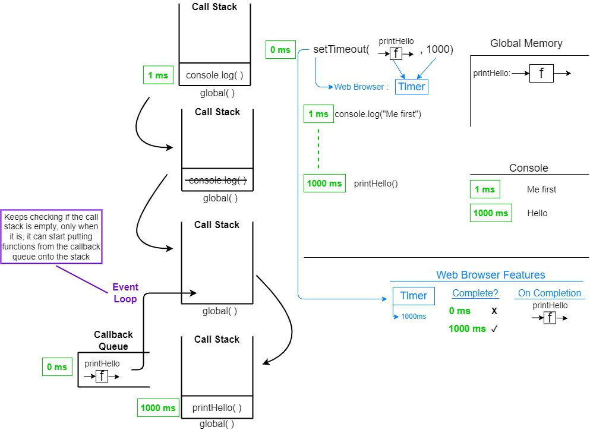

<details>
<summary>Principles of JavaScript</summary>
<br>

# JavaScript Principles:

## When JavaScript code runs, it:
Goes through the code line-by-line and runs/executes each line -known as the **thread of execution**  

JavaScript has only **one thread of execution**

Saves "data" like strings and arrays so we can use that data later - in its **memory**

## Execution context
Created to run the code of a function - has 2 parts
- Thread of execution
- Memory

```javascript
const num = 3;
function multiplyBy2 (inputNumber) {
  const result = inputNumber*2;
  return result;
}

const output = multiplyBy2(num)
const newOutput = multiplyBy2(10);
```

### What happens under the hood when this code runs (JavaScript executes code line-by-line top down):
1. The *global* **Execution Context** is created (created for running the main program)
2. **[In global memory]** defining/saving a constant *num*, assigning value 3 to it
3. **[In global memory]** defining/saving the function *multiplyBy2*, the code inside the function will also be saved in memory
4. **[In global memory]** defining/saving a constant *output*, no value will be assigned to it for now (uninitialized)
5. *multiplyBy2* function will be executed, the argument passed into it will evaluate to value 3 - *multiplyBy2( 3 )*
6. A new **Execution Context** specifically for executing  *multiplyBy2* - it will also have memory, called *local memory* for storing local data
7. **[In local memory]** defining/saving the parameter *inputNumber*, assigning to it the argument passed into the function, that is 3
8. **[In local memory]** defining/saving the constant *result*, assigning to it the result of the expression *inputNumber\*2* which evaluates to 6
9. *multiplyBy2(num)* will return the value of the constant *result* which is 6, which means it will *evaluate* to 6 (*output = multiplyBy2(num) = multiplyBy2(3) = 6 <=> output = 6*)
10. **[In global memory]** the already defined constant *output* will get assigned a value of 6
11. **[In global memory]** defining/saving a constant *newOutput* no value will be assigned to it for now (uninitialized)
12. Step 5 will be repeated, and the function *multiplyBy2* will be called with the argument 10

## Call stack
JavaScript keeps track of what function is currently running (where's the thread of execution)  

Run a function -> add to call stack  

Finish running the function -> JS removes it from call stack  

Whatever is at the top of the call stack -> that's the function we're currently running


### What happens on the call stack when the code above runs:

``` 
Call stack
1. The global execution context is added at the bottom of the call stack, and that will be there until the whole program is executed, for our example we will call it "global()"

|                |  
|                |   
|                |  
|                |
------------------   
|     global()   |
------------------ 

2. When we encounter the call of the function multiplyBy2(num), a new execution context will be created and will be added onto the stack

|                |  
|                |   
|                |  
------------------
|multiplyBy2(num)|
------------------   
|     global()   |
------------------  

3. After multiplyBy2(num) executes and returns, its execution context will be popped off the stack

|                |  
|                |   
|                |  
|                |
------------------   
|     global()   |
------------------ 

4. Then we encounter the call of the function multiplyBy2(10), and again, a new execution context will be created and will be added onto the stack

|                |  
|                |   
|                |  
------------------
|multiplyBy2(10)|
------------------   
|     global()   |
------------------  

5. After multiplyBy2(10) executes and returns, its execution context will be popped off the stack

|                |  
|                |   
|                |  
|                |
------------------   
|     global()   |
------------------ 

6. When the program terminates, global() will also be popped off the stack
```
</details>

<details>
<summary>Functions and Callbacks</summary>
<br>

# Functions and Callbacks:

## Higher order functions
Any function that takes in a function as parameter and/or returns a function

## Callback functions
Any function that is **passed as an argument to another function**

It allows a function to call another function

A callback function can run after another function has finished

### Example code:
```javascript
// Higher order function
function copyArrayAndManipulate(array, instructions) {
  const output = [];
  for (let i = 0; i < array.length; i++) {
    output.push(instructions(array[i]))
  }
  return output;
}

// Callback 
function multiplyBy2(input) {
  return input * 2;
}

const result = copyArrayAndManipulate([1, 2, 3], multiplyBy2);
```

</details>

<details>
<summary>Closure</summary>
<br>

# Closure:

### Example of closure in JS
```javascript
// returns a function that takes as parameter "num"
// and returns the result of num * 2;
function createFunction() {
  function multiplyBy2 (num){
    return num * 2;
  }
  return multiplyBy2;
}

// generatedFunc now basically becomes multiplyBy2
// same functionality, different name
const generatedFunc = createFunction();

// the value stored into result will be num * 2 -> 3 * 2 -> 6
const  result = generatedFunc(3);

// IMPORTANT
// To find the actual code to execute in order to run generatedFunc(3), JavaScript will
// not look into createFunction which is stored in loacl memory but it will look into generatedFunc
// which is also stored in global memory
```
<br>

## Making our functions have "persistent memory"
<br>

```javascript
function outer() {
  let counter = 0; // will be found inside [[scope]] once the function returns
  function incrementCounter() {
    counter++;
  }
  return incrementCounter;
}

const myNewFunction = outer();
myNewFunction(); // counter == 1
myNewFunction(); // counter == 2
```

### So how does this work?
1. The function *outer* will be saved into global memory
2. Once we reach *const myNewFunction = outer()*, a constant called myNewFunction will be saved in memory, but the constant will not yet be initialized
3. The function called *outer* will be executed
4. It will return the function *incrementCounter* which will be saved into *myNewFunction* in global memory  

## Important:  
**The incrementCounter function that is returned in step 4. will have a hidden property called *\[\[scope\]\]***  
**In that *\[\[scope\]\]* property, all data that the *incrementCounter* function needs in order to run, and is inside the higher order function (in this case, the function *outer()*), will be present, and available for use whenever *incrementCounter* will be run**  

### That is how *myNewFunction()* can run successfully, and access the *counter* in order to increment it.
</details>

<details open>
<summary>Asynchronous JavaScript</summary>
<br>

# Asynchronous JavaScript:

### Asynchronous JavaScript is not something that is built into the language itself, but is *called* from the language and provided by the browser.  

### Other examples of functionality provided by the browser that we *call* from JavaScript

| Javascript code  |  Browser feature | 
|---|---|
| console  | Console  |
| setTimeout  | Timer  |
| document  | HTML DOM  |
| xhr/fetch  | Network request  |
| localStorage  | Local storage  |

<br>

### Let's start from this example:  
```javascript
function printHello() {
  console.log("Hello);
}

setTimeout(printHello, 1000);

console.log("Me first!");
```
<br>

### Diagram of what happens when this code is executed  


</details>